# Lasso Regression

Lasso is a regression analysis method that performs both variable selection and regularization in order to enhance the prediction accuracy and interpretability of the resulting statistical model.

# Images
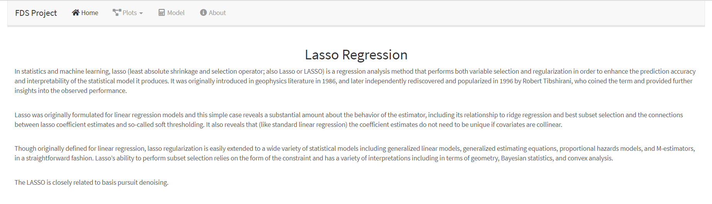
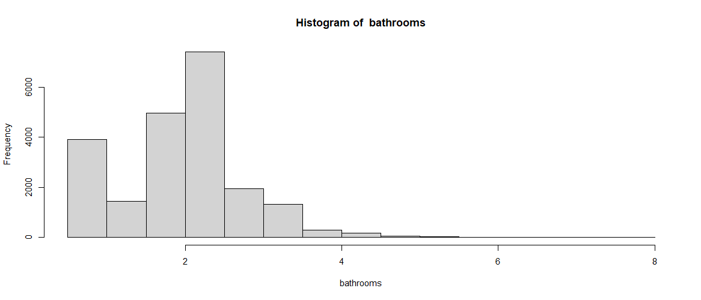
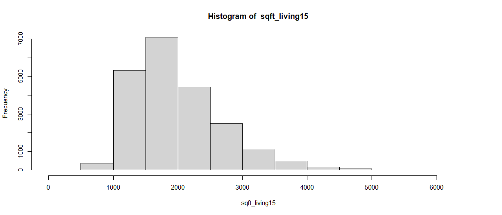
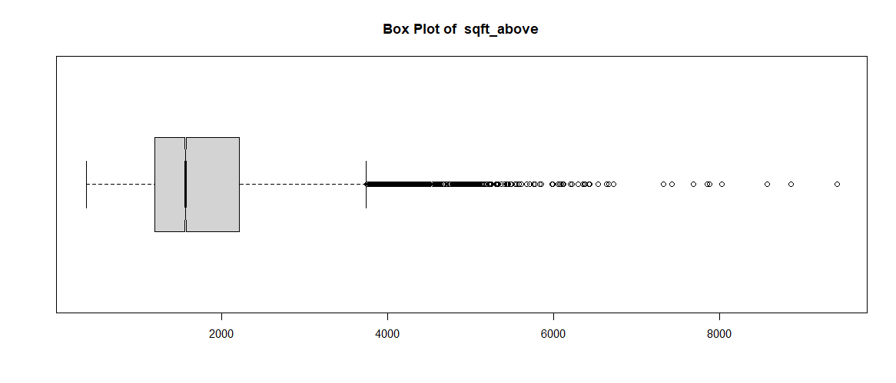
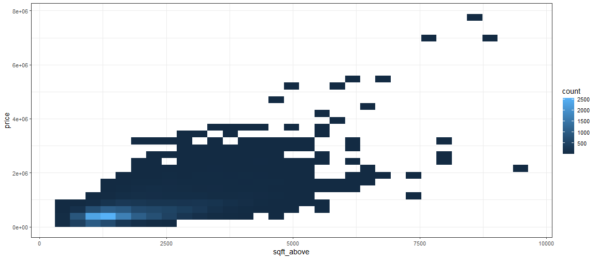
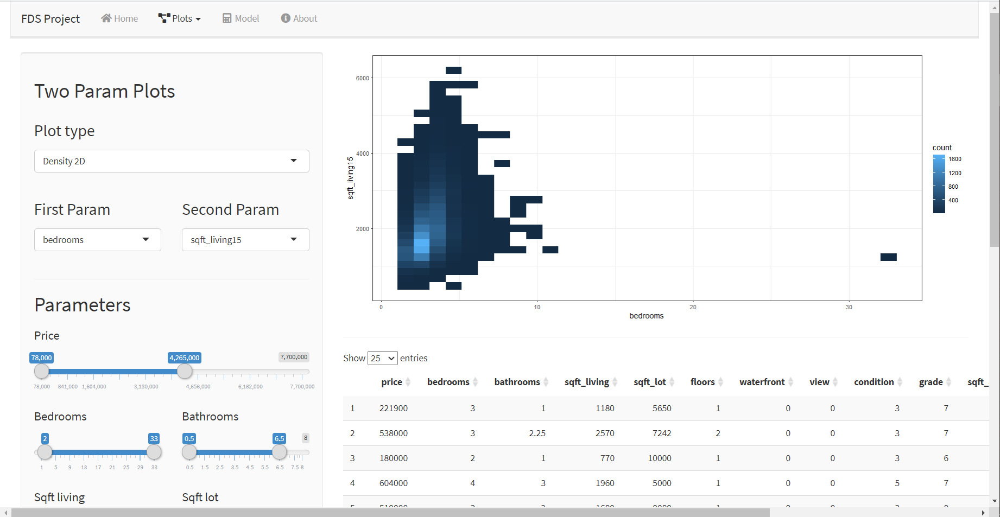
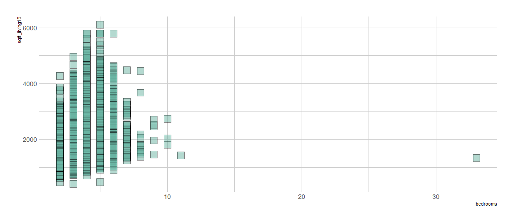
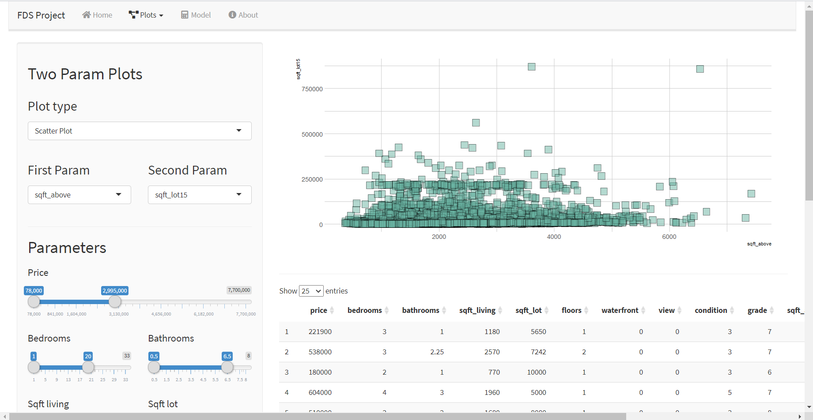
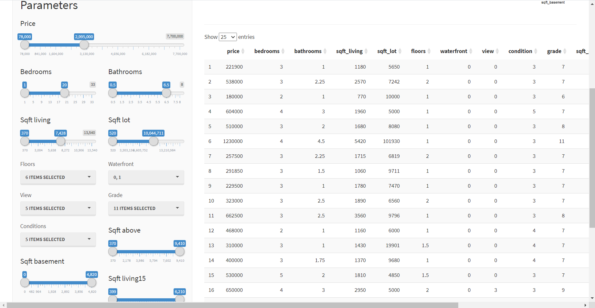
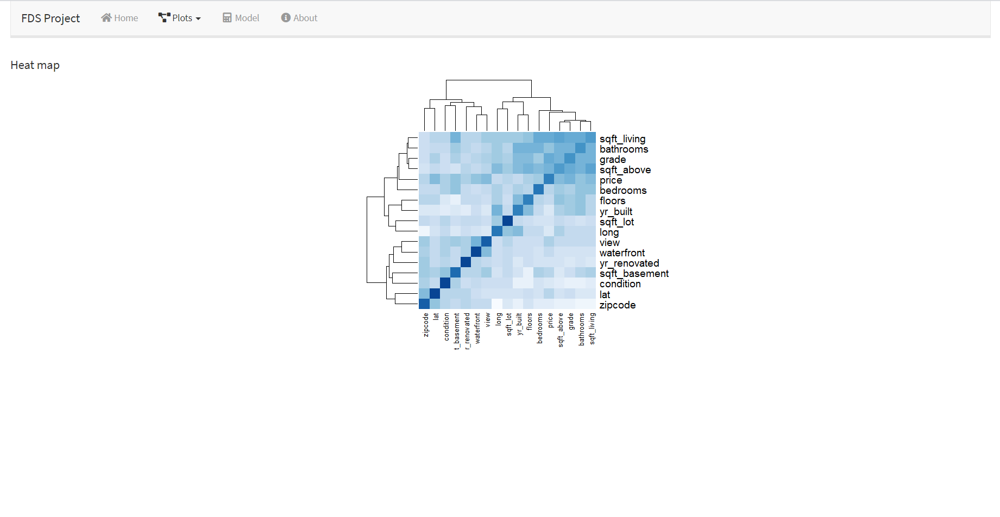
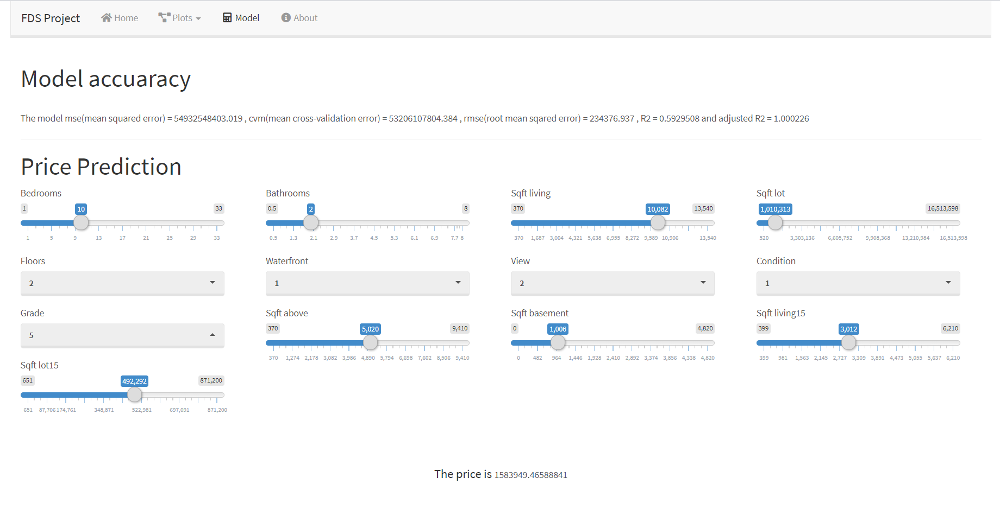
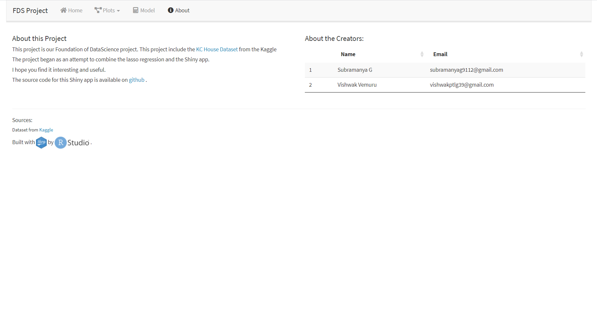

# About this project
This project is done for our FDS activity, with the help of R and Shiny.
